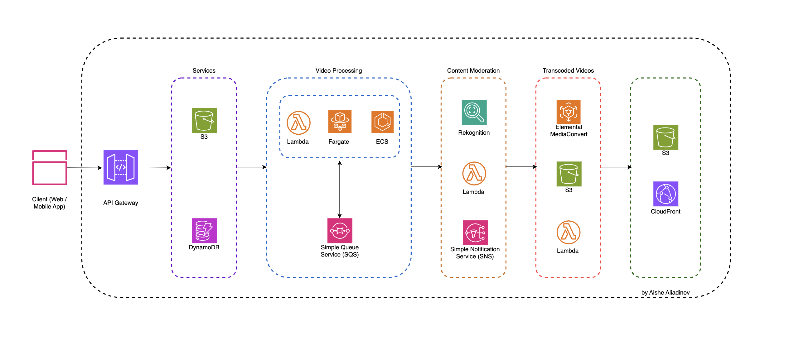

# Design Video Sharing Platform "CloudView"

Designing and comparing different architectures for a simplified video-sharing platform (we gave it name "CloudView") is an important project for several reasons, especially in the cloud engineering and solutions architecture. It will provide opportunity to apply theoretical knowledge about system design, cloud services, and software architecture to a practical, real-world scenarios, lead engineers to weigh the pros and cons of different architectural choices (e.g., traditional server-based vs. serverless architectures) in terms of cost, scalability, complexity, and resilience.

We will be focusing on describing key features of the CloudView, along with the highlighting the architectural specifics of the design and focusing on scalability, resiliency, and latency. 

**1. Video upload and storage** -> user will be able to upload videos in a high-resolution format via a web or mobile interface directly to **Amazon S3** via a pre-signed URL. This reduces load on backend servers.

Why S3 -> Amazon S3 offers high availability, scalability, reliability and durability for storing large video files. It supports direct uploads from the client, optimizing performance and reducing load on backend servers. S3 automatically scales to store large files and high-volume uploads.

**2. Metadata handling** -> platform will be able to store and retrieve video metadata such as title, description, tags, uploader information, upload timestamp, etc., in a **NoSQL Database** (e.g., Amazon DynamoDB). Queries support efficient filtering, searching, and retrieving metadata.

Why is NoSQL -> Metadata typically includes semi-structured data that may evolve over time (e.g., adding new fields for user ratings, categories). NoSQL databases offer flexibility, high throughput, and scalability, which are important for read-heavy and write-heavy operations, like browsing and filtering videos. DynamoDB is horizontally scalable, offering consistent performance even at high request volumes.

**3. Video processing** -> will involve the following steps:
1. Upon upload, a message is sent to an **Amazon SQS queue** to trigger video processing.
2. **AWS Lambda functions** or an **AWS Fargate / ECS service** can be used to transcode videos into multiple resolutions (e.g., 1080p, 720p, 480p). Multiple Lambda functions can operate concurrently for efficient transcoding.
3. Transcoded videos are saved in different **S3** buckets / folders for easy retrieval based on user device and bandwidth.

Why serverless -> automatically scale based on demand, cost-effective (pay-per-use model), and simplifies video processing workflows. At the same time, we should keep in mind that cold start latency can be a concern for real-time processing. AWS Fargate or ECS service can offer greater control if consistent performance is required. Failures can be retried using SQS dead-letter queues.

**4. Content analysis** -> to automate content analysis, use a content moderation service, like **AWS Rekognition**, to analyze uploaded videos for inappropriate content. The system sends videos to the moderation service upon upload, and if flagged, videos are marked for review in the metadata database and may be removed or hidden based on the moderation rules. Content analysis results are stored in the metadata database **(NoSQL)** and used to determine video visibility.

Why AWS Rekognition -> it provides powerful, pre-built capabilities for analyzing images and videos for inappropriate content, enabling automated moderation. Processing time should be minimized which lead to the low latency; asynchronous handling ensures minimal impact on the user experience. AWS Rekognition quickly identifies objects, activities, or explicit content, helping to flag potentially unsuitable videos, thus simplifying content compliance and user safety processes.

Besides AWS Rekognition, **AWS Lambda** and **Amazon Simple Notification Service (SNS)** optionally can be utilized. AWS Lambda handles the orchestration of content moderation tasks, such as calling AWS Rekognition, processing results, and marking content for review if needed. Amazon SNS is used to send alerts or notifications if a video is flagged during moderation.

**AWS Elemental MediaConvert** is used for video transcoding, creating multiple resolutions and formats suitable for different devices and network conditions. **Amazon S3** stores the output (transcoded videos) in different folders or buckets based on resolutions (e.g., 1080p, 720p, 480p) and allows integration with Amazon CloudFront for content delivery. **AWS Lambda** is used to trigger transcoding workflows or handle post-processing tasks such as updating metadata after transcoding is complete.

**5. Video delivery** -> for the content delivery use **Content Delivery Network (CDN) like Amazon CloudFront** to serve videos with minimal latency globally. Requests for video content are routed through CloudFront to the nearest edge location for minimal latency and faster delivery.

Why CDN -> Leverage CDN caching policies and S3 versioning ensure updates to video content are distributed quickly. The CDN reduces load on the origin server and provides a seamless viewing experience for users across the globe.

As a result, we can summarize that services, like S3, DynamoDB, Lambda functions, and the CDN, offer **automatic scaling** to handle high demand. Redundant storage, auto-scaling functions, and failover mechanisms ensure system **reliability.** Leveraging CDNs for video delivery and serverless functions for processing minimizes **latency** for end users. This whole design achieves a highly scalable, reliable, and efficient video-sharing platform with minimal latency and strong content moderation capabilities.

